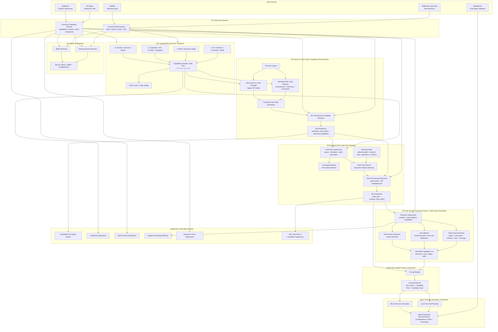

# SkillRQ

SkillRQ / CapabilityRQ 是一个面向 **LLM Agent capability selection** 的研究型工程项目。当前研究任务已经从单一 **Skill Recommendation** 扩展为统一的 **Agent Capability Recommendation**：Agent 可调用的能力单元既可以是高层封装的 skills，也可以是更细粒度的 tools / APIs / functions / runtime actions。

核心目标是保留并强化 **codebook-centric** 的方法主线：用可解释的 capability semantic codebook 替代纯文本级 query span decomposition，让完整用户 query 在 capability semantic space 中生成多个 code paths，再经过 residual code path planning、code-aware reranking 和 code-path-guided prompt construction，最终为 LLM Agent 提供结构化的 tool-use planning support。

项目执行计划与文件架构见：

- [执行计划](docs/EXECUTION_PLAN.md)
- [项目文件架构](docs/PROJECT_STRUCTURE.md)

---

## 1. 模型架构总览

SkillRQ / CapabilityRQ 的主线不是普通 dense retrieval，也不是单纯 reranker，而是：

```text
User Query
→ Capability Semantic Codebook
→ Multi-Path Query-to-Code Prediction
→ Residual Code Path Planning
→ Code-Aware Candidate Retrieval / Reranking
→ Code-Path-Guided LLM Prompt Construction
→ Agent Tool-Use Simulation / Evaluation
```

### 1.1 全流程 Mermaid 图



### 1.2 关键设计原则

1. **Codebook 是核心中间层**：M3 的 L1/L2/L3/L4 code path 不是辅助特征，而是 query understanding、candidate retrieval、coverage planning、reranking 和 prompt construction 之间的统一语义接口。
2. **M4 负责 query-to-code**：新版 `soft-multipath` 分支将 query 当作 multi-positive 样本，学习 code path distribution，并加入 hierarchical code prediction 与 query-code contrastive alignment。
3. **M5 负责 residual code path planning**：M5 不只是输出 flat top-k code paths，而是逐步维护 residual state，生成 `code_plan`，并在每一步检索对应 candidate tools/APIs。
4. **M7 负责 code-aware reranking**：M7 在 relevance / role / stage / order 之外，显式引入 predicted code path、candidate native code path、schema、coverage 和 prompt usefulness。
5. **Prompt construction 是正式模块**：最终输出不是 flat tool list，而是 code-path-structured capability plan，可直接转化为 LLM agent planner prompt。

---

## 2. 数据与标准产物

主要数据源：

- `ToolBench/data`: 主实验数据集，用于 tool/API recommendation、multi-tool coverage、execution-stage modeling。
- `DAMO-ConvAI/api-bank`: 补充验证集，用于多轮 tool-use、API 调用链和较小规模工具库泛化评估。
- `skillret/`: skill-level supervised retrieval 数据。
- `skillrouter/eval_core/`: skill-level 泛化评测与 hard negative 补充数据。
- `sra_bench/bench/`: 多技能覆盖、implicit skill 和 agent-level 评测候选数据。
- `skillsbench`: 最终 Agent 端到端评测候选数据集。

Capability-level canonical outputs：

```text
data/processed/capability/
├── capabilities.jsonl
├── capability_queries.jsonl
├── capability_qrels.jsonl
├── capability_sequences.jsonl
└── capability_stats.json
```

已完成的 ToolBench + API-Bank 全量构建规模：

```text
capabilities = 64,645
queries      = 329,625
qrels        = 813,490
sequences    = 447,066
```

---

## 3. 主要模块说明

### M1: Data Normalization

统一 SkillRet、ToolBench、API-Bank、SkillRouter-style 数据到 canonical schema。

```bash
python3 -m skillrq data build --dataset skillret
python3 -m skillrq capability build --dataset all
```

### M2: Retrieval Baselines

提供 BM25 与 hashing dense retrieval baseline，并输出 Recall / NDCG / MRR / Completeness 等指标。

```bash
python3 -m skillrq m2 run
```

### M3: CapabilityRQ Semantic Codebook

构建四层 capability semantic code path：

```text
L1: Domain / Scenario / Artifact
L2: Operation / API Function / Capability
L3: Role / Execution Stage
L4: Input-Output / Schema / Constraint / Detail
```

```bash
python3 -m skillrq m3 build
```

主要输出：

```text
data/processed/capability/code_assignments.jsonl
data/processed/capability/code_quality.json
data/processed/skill/code_assignments.jsonl
data/processed/skill/code_quality.json
reports/code_cards/
```

### M4: Query-to-Code Latent Capability Decomposition

M4 有两个分支：

```text
hard            legacy query-to-code classifier
soft-multipath  multi-positive code path distribution predictor
```

推荐优先使用 soft multi-path M4：

```bash
python3 -m skillrq m4 train \
  --target capability \
  --model-kind soft-multipath \
  --data-root data/processed/m4_sequence_eval/capability \
  --output-root runs/m4_query_to_code/soft_multipath/capability_sequence_eval \
  --epochs 20 \
  --batch-size 512 \
  --learning-rate 3e-4 \
  --embedding-dim 512 \
  --hidden-dim 1024 \
  --code-embedding-dim 256 \
  --hierarchy-weight 1.0 \
  --contrastive-weight 1.0 \
  --path-bce-weight 0.2 \
  --contrastive-negative-count 512 \
  --temperature 0.07 \
  --device cuda
```

预测 code path distribution 并检索 candidates：

```bash
python3 -m skillrq m4 predict \
  --target capability \
  --model-kind soft-multipath \
  --data-root data/processed/m4_sequence_eval/capability \
  --checkpoint-root runs/m4_query_to_code/soft_multipath/capability_sequence_eval \
  --output-root runs/m4_query_to_code/predictions/soft_multipath/capability_sequence_eval \
  --top-n-paths 16 \
  --candidate-budget 100 \
  --beam-width 8 \
  --score-blend 0.65 \
  --split sequence_test \
  --device cuda
```

M4 prediction 输出包含：

```text
predicted_code_paths[].semantic_id
predicted_code_paths[].codes
predicted_code_paths[].probability
predicted_code_paths[].verbalization
retrieved_capabilities[]
```

### M5: Residual Multi-Code Path Planning

M5 有两个分支：

```text
coverage   旧版 residual candidate coverage baseline
code-plan  新版 residual code path planning 主分支
```

基于 M4 soft multi-path predictions 准备 code-plan 数据：

```bash
python3 -m skillrq m5 prepare \
  --target capability \
  --model-kind code-plan \
  --m4-data-root data/processed/m4_sequence_eval/capability \
  --m4-prediction-path runs/m4_query_to_code/predictions/soft_multipath/capability_sequence_eval/predictions.jsonl \
  --output-root data/processed/m5_code_plan/capability_sequence_eval \
  --max-steps 6
```

训练 residual code path planner：

```bash
python3 -m skillrq m5 train \
  --target capability \
  --model-kind code-plan \
  --data-root data/processed/m5_code_plan/capability_sequence_eval \
  --output-root runs/m5_code_path_planner/capability_sequence_eval \
  --epochs 20 \
  --batch-size 2048 \
  --learning-rate 3e-4 \
  --embedding-dim 512 \
  --hidden-dim 1024 \
  --coverage-weight 1.0 \
  --role-weight 0.3 \
  --stop-weight 0.3 \
  --device cuda
```

使用 code-plan 分支输出 `code_plan`：

```bash
python3 -m skillrq m5 predict \
  --target capability \
  --model-kind code-plan \
  --m4-data-root data/processed/m4_sequence_eval/capability \
  --m4-prediction-path runs/m4_query_to_code/predictions/soft_multipath/capability_sequence_eval/predictions.jsonl \
  --checkpoint-root runs/m5_code_path_planner/capability_sequence_eval \
  --output-root runs/m5_code_path_planner/predictions/capability_sequence_eval \
  --max-steps 6 \
  --top-n-paths 16 \
  --candidates-per-step 20 \
  --stop-threshold 0.55 \
  --split sequence_test \
  --device cuda
```

M5 code-plan 输出包含：

```text
code_plan[].code_path
code_plan[].role
code_plan[].purpose
code_plan[].expected_coverage_gain
code_plan[].stop_probability
residual_code_paths[].retrieved_capabilities
```

### M7: Role-Aware / Sequence-Aware / Code-Aware Reranking

M7 对 M4/M5 candidate pool 进行 reranking。当前包含：

```text
basic reranker       relevance + role + stage + order
joint ablation       shared encoder / soft code distribution
code-aware reranker  query + code path + schema + coverage + prompt usefulness
```

训练 Code-Aware M7：

```bash
python3 -m skillrq m7 train \
  --target capability \
  --model-kind code-aware \
  --data-root data/processed/m7_sequence_eval/capability \
  --output-root runs/m7_code_aware_reranker/capability_sequence_eval \
  --epochs 10 \
  --batch-size 2048 \
  --learning-rate 3e-4 \
  --embedding-dim 512 \
  --hidden-dim 1024 \
  --role-weight 0.2 \
  --stage-weight 0.2 \
  --order-weight 0.2 \
  --code-consistency-weight 0.3 \
  --schema-weight 0.2 \
  --coverage-gain-weight 0.2 \
  --prompt-usefulness-weight 0.3 \
  --device cuda
```

使用 Code-Aware M7 rerank M5 predictions：

```bash
python3 -m skillrq m7 predict \
  --target capability \
  --model-kind code-aware \
  --m4-data-root data/processed/m4_sequence_eval/capability \
  --prediction-path runs/m5_code_path_planner/predictions/capability_sequence_eval/predictions.jsonl \
  --checkpoint-root runs/m7_code_aware_reranker/capability_sequence_eval \
  --output-root runs/m7_code_aware_reranker/predictions/capability_sequence_eval \
  --top-k 100 \
  --device cuda
```

### Prompt Construction

将 M5 code plan 与 M7 reranked capabilities 转换为 LLM Agent planner 可直接使用的结构化 prompt。

```bash
python3 -m skillrq prompt build \
  --prediction-path runs/m7_code_aware_reranker/predictions/capability_sequence_eval/reranked_predictions.jsonl \
  --m5-prediction-path runs/m5_code_path_planner/predictions/capability_sequence_eval/predictions.jsonl \
  --output-root runs/prompt_construction/capability_sequence_eval \
  --top-tools-per-step 3 \
  --max-steps 6
```

Prompt records 包含：

```text
User Query
Capability Plan
Step role / operation
Required capability code path
Candidate tools
Why needed
Planner Instruction
```

### Agent Simulation

先用 mock simulator 验证 prompt schema / parser / evaluator，再接入 vLLM 做真实 LLM tool-call planning。

```bash
python3 -m skillrq agent-sim mock \
  --prompt-record-path runs/prompt_construction/capability_sequence_eval/prompt_records.jsonl \
  --output-root runs/agent_sim/mock/capability_sequence_eval \
  --max-calls 6 \
  --tools-per-step 1

python3 -m skillrq agent-sim evaluate \
  --plan-path runs/agent_sim/mock/capability_sequence_eval/tool_call_plans.jsonl \
  --output-path reports/tables/agent_sim_mock_capability_sequence_eval.json \
  --top-k 1,3,5,10
```

vLLM 推理入口：

```bash
python3 -m skillrq agent-sim vllm \
  --prompt-record-path runs/prompt_construction/capability_sequence_eval/prompt_records.jsonl \
  --output-root runs/agent_sim/vllm/capability_sequence_eval \
  --model Qwen/Qwen2.5-7B-Instruct \
  --tensor-parallel-size 1 \
  --dtype auto \
  --gpu-memory-utilization 0.90 \
  --temperature 0.0 \
  --top-p 1.0 \
  --max-tokens 512 \
  --batch-size 32
```

---

## 4. 诊断实验与上界分析

当 M4/M5/M7 指标偏低时，优先运行 diagnostics，而不是盲目调大模型。

```bash
python3 -m skillrq diagnostics run \
  --target capability \
  --top-k 5,10,20,50,100
```

主要输出：

```text
reports/diagnostics/capability/candidate_pool_upper_bounds.json
reports/diagnostics/capability/candidate_pool_failure_cases.jsonl
reports/diagnostics/capability/codebook_diagnostics.json
reports/diagnostics/capability/codebook_query_cases.jsonl
reports/diagnostics/capability/multi_positive_diagnostics.json
reports/diagnostics/capability/negative_sampling_diagnostics.json
reports/diagnostics/capability/sequence_chain_diagnostics.json
reports/diagnostics/capability/diagnostics_summary.json
```

M5 evaluate 偏低时，优先检查：

```bash
python3 scripts/diagnose_m5_nested_candidates.py \
  --prediction-path runs/m5_code_path_planner/predictions/capability_sequence_eval/predictions.jsonl \
  --output-path reports/tables/m5_nested_candidates_diagnostic.json

python3 scripts/diagnose_m5_codepath_to_candidate.py \
  --prediction-path runs/m5_code_path_planner/predictions/capability_sequence_eval/predictions.jsonl \
  --m4-data-root data/processed/m4_sequence_eval/capability \
  --output-path reports/tables/m5_codepath_to_candidate_diagnostic.json

python3 scripts/diagnose_m4_m5_candidate_reuse.py \
  --m4-prediction-path runs/m4_query_to_code/predictions/soft_multipath/capability_sequence_eval/predictions.jsonl \
  --m5-prediction-path runs/m5_code_path_planner/predictions/capability_sequence_eval/predictions.jsonl \
  --output-path reports/tables/m4_m5_candidate_reuse_diagnostic.json
```

---

## 5. 当前已完成阶段

- M0: 项目初始化。
- M1: 数据规范化，包括 SkillRet、ToolBench、API-Bank。
- M2: Capability Retrieval Baselines，包括 BM25、hashing dense、统一 metrics、baseline artifact 与 data stats。
- M3: CapabilityRQ Codebook v1，包括四层 semantic code path、code quality、code assignments 与 code cards。
- M4: Query-to-Code Latent Capability Decomposition，包括 hard query-to-code、soft multi-path query-to-code、RQ-KMeans/RQ-VAE 对照入口、预测与评估脚本。
- M5: Residual Multi-Code Path Planning，包括旧版 coverage selector 与新版 code-plan planner、逐步推理、coverage metrics 与 SwanLab 记录。
- M7: Role-Aware / Sequence-Aware / Code-Aware Reranker，包括 reranker 数据构造、多任务训练、joint ablation、code-aware reranking 与 sequence metrics。
- Prompt Construction: code-path-guided LLM prompt construction，将 M5 code plan 与 M7 reranked capabilities 转换为 agent planning prompt。
- Agent Simulation: mock tool-use simulation + vLLM tool-call planning + evaluation。
- Diagnostics: 候选池 oracle 上界、codebook 混杂度、multi-positive 分布、negative sampling 难度、M5 code path 到 candidate 断点与 sequence 评估链路诊断。
- M6: Granularity-Aware Hypergraph Expansion 当前先跳过，作为后续 optional branch。
- LLM query span decomposition + segment retrieval 当前保留为后续可选 baseline。

---

## 6. 测试

```bash
/opt/homebrew/anaconda3/bin/pytest
```

当前测试结果：

```text
18 passed
```
